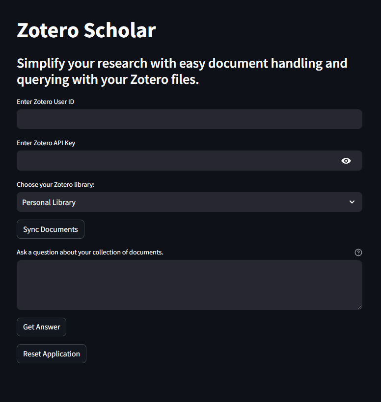

# ZoteroScholar

Enhance your research workflow with ZoteroScholar, a tool that integrates the powerful Zotero document management system with the natural language processing capabilities of Ollama. Perfect for academics, researchers, and anyone looking to efficiently search through their collection of research-related documents.




## Features

- **Easy Setup**: Simple setup process, requiring only your Zotero User ID and API Key.
- **Document Synchronization**: Sync documents from your personal Zotero library or selected Zotero groups directly into the application.
- **Document Querying**: Perform natural language queries on your collection of documents to find relevant information quickly.

## Getting Started

## Prerequisites

- Python 3.10 or newer
- Pip package manager
- Zotero account. You will need your Zotero User ID and API Key to sync documents:
    - **Finding your Zotero User ID**: 
        - Log into the Zotero web interface.
        - Click on your username at the top right corner to access your profile.
        - Your User ID is part of the URL of your profile page. It's a numerical identifier.
    - **Generating an API Key**:
        - While logged into the Zotero website, navigate to the [Settings](https://www.zotero.org/settings) page.
        - Click on the 'Feeds/API' tab.
        - Under 'Personal API Keys', click on 'Create new private key'.
        - Give your key a name, select the permissions you wish to grant (for syncing documents, 'Read/Write' access is usually necessary), and save.
        - Zotero will then generate an API Key for you. Make sure to copy and save this key securely, as it won't be shown again.


### Installation

Follow these steps to get Zotero Scholar up and running on your system:

1. **Clone the repository**:

    ```bash
    git clone https://github.com/coconutcow/zotero-scholar.git
    cd zotero-scholar
    ```

2. **Install the required Python packages**:
   
    ```bash
    pip install langchain_community langchain gpt4all qdrant-client streamlit pyzotero pypdf2
    ```

3. **Set up Ollama LLM**: 
   
    ZoteroScholar leverages Ollama LLM for its query processing. To use Ollama:
    
    - First, ensure you have Ollama installed. [Visit Ollama's official website](https://ollama.com/) for installation instructions.
    - Pull the 7b chat model using the command: `ollama pull 7b-chat`.

### Directory Structure

Upon cloning and setting up, your project directory should look like this:
```
zotero-scholar/
├── run.py
├── utils/
│ ├── init.py
│ ├── pdf_loader.py
│ ├── query_processor.py
│ ├── text_processor.py
│ └── zotero_downloader.py
└── data/
 └──zotero_papers/ (created after running the Zotero sync)
```
- `run.py`: The main script to run the Zotero Scholar application.
- `utils/`: Contains utility scripts for downloading, processing, and querying documents.
- `data/`: The default directory where documents from Zotero are synchronized. This directory is created automatically when you sync documents for the first time.
- `tmp/`: This is where your vector database (qdrant) gets stored.


### Running Zotero Scholar
With the setup complete, you can run the application using Streamlit:
```bash
streamlit run run.py
```
Access the provided URL in your web browser to start using Zotero Scholar.

### How to Use
1. Sync Documents: Enter your Zotero User ID and API Key, choose your library source, and click "Sync Documents" to download your documents.
2. Query Documents: After syncing, use the text area to type in your query and click "Get Answer" to find information within your document collection.


### Contributing
Contributions to Zotero Scholar are welcome. Please feel free to fork the repository, make changes, and submit pull requests.


### License
Zotero Scholar is made available under the MIT License.
